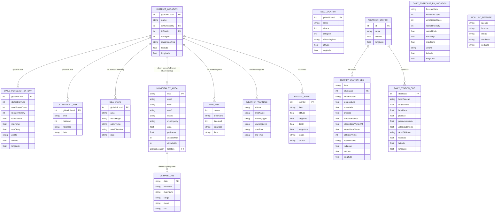
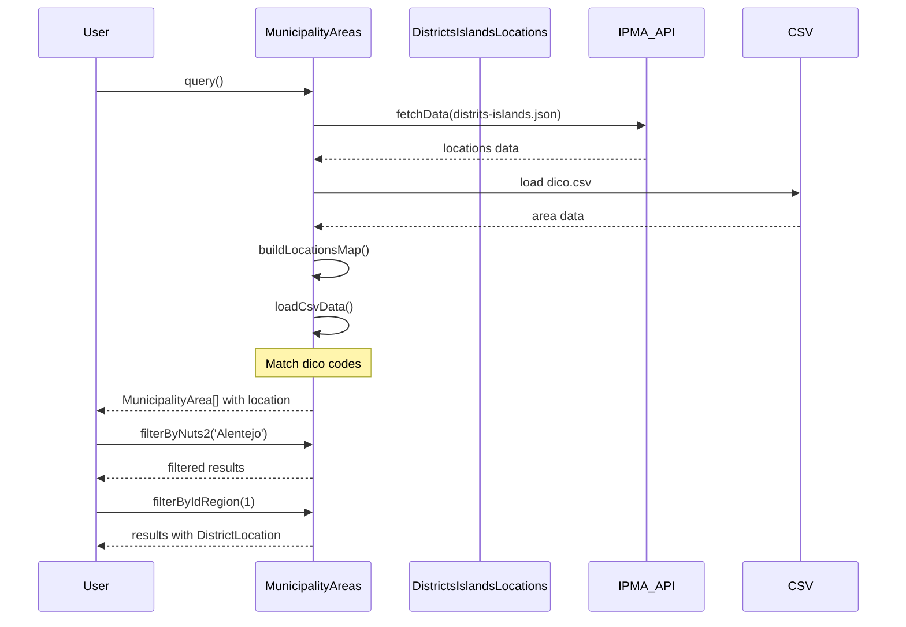

# IPMA API Data Relations

This diagram shows the relationships between different API endpoints and their data fields.

## Entity Relationship Diagram

## API Endpoint Mapping

```mermaid
flowchart TD
    subgraph Service["Service Endpoints"]
        DL["/distrits-islands.json<br/>DistrictsIslandsLocations"]
        SL["/sea-locations.json<br/>SeaLocations"]
        WS["/stations.json<br/>WeatherStations"]
        MA["dico.csv<br/>MunicipalityAreas"]
    end

    subgraph Forecast["Forecast Endpoints"]
        DF["/cities/daily/{globalIdLocal}.json<br/>DailyWeatherForecastByLocation"]
        FR["/rcm/rcm-d{idDay}.json<br/>FireRiskForecast"]
        UV["/uv/uv.json<br/>UltravioletRiskForecast"]
        SSF["/hp-daily-sea-forecast-day{idDay}.json<br/>SeaStateForecast"]
        WW["/warnings_www.json<br/>WeatherWarnings"]
    end

    subgraph Observation["Observation Endpoints"]
        SO["/observations.json<br/>WeatherStationObservation"]
        SE["/seismic/{idArea}.json<br/>SeismicInformation"]
        MO["/CI_SNMB.geojson<br/>MolluscHarvestingProhibition"]
    end

    subgraph Climate["Climate Endpoints (CSV)"]
        MT["/mtxmx-{DICO}-{municipality}.csv<br/>MaximumDailyTemperature"]
        MiT["/mtnmn-{DICO}-{municipality}.csv<br/>MinimumDailyTemperature"]
        TP["/mrrto-{DICO}-{municipality}.csv<br/>TotalDailyPrecipitation"]
        ET["/et0-{DICO}-{municipality}.csv<br/>DailyEvapotranspirationReference"]
        PD["/mpdsi-{DICO}-{municipality}.csv<br/>PalmerDroughtSeverityIndex"]
    end

    %% Key relationships
    DL -->|"globalIdLocal"| DF
    DL -->|"idWarningArea"| FR
    DL -->|"globalIdLocal"| UV
    DL -->|"globalIdLocal"| SSF
    DL -->|"idWarningArea"| WW
    DL -->|"dico mapping"| MA

    WS -->|"idEstacao"| SO

    DL -->|"idArea"| SE

    MA -->|"DICO"| MT
    MA -->|"DICO"| MiT
    MA -->|"DICO"| TP
    MA -->|"DICO"| ET
    MA -->|"DICO"| PD
```

## Key Field Relationships

| Source Entity | Field | Target Entity | Field | Relationship |
|--------------|-------|---------------|-------|--------------|
| DistrictLocation | globalIdLocal | DailyForecastByDay | globalIdLocal | 1:N Forecast per location |
| DistrictLocation | globalIdLocal | UltravioletRisk | globalIdLocal | 1:1 UV risk per location |
| DistrictLocation | idWarningArea | FireRisk | idArea | 1:N Risk areas |
| DistrictLocation | idWarningArea | WeatherWarning | idArea | 1:N Warnings per area |
| DistrictLocation | idDistrict + idMunicipality | MunicipalityArea | dico | 1:1 Area data |
| WeatherStation | id | HourlyStationObservation | idEstacao | 1:N Observations |
| MunicipalityArea | dico | Climate CSVs | DICO path param | 1:N Climate series |

## Data Flow Example

